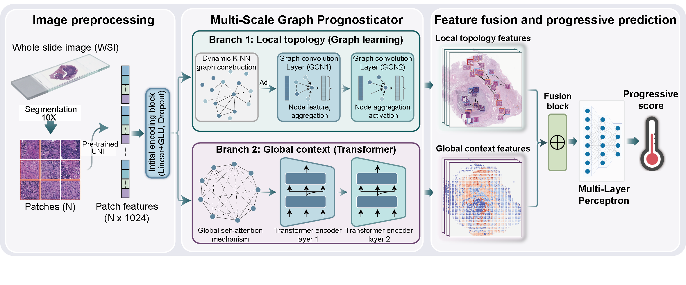

# MuSGraP
MuSGraP (Multi-Scale Graph Prognosticator) is a weakly supervised deep learning framework that fuses local topological patterns captured by dynamic graph convolution with global contextual interactions modeled by transformer self-attention to enable annotation-free, robust postoperative progression risk stratification in limited-stage small cell lung cancer from H&E-stained whole-slide images.

<p align="center">
  
</p>

The repository covers three major stages:

1. `01_data_processing`: whole-slide tiling, foundation-model feature extraction, tile quality control.
2. `02_model_development`: MuSGraP training, MuSGraP eval, interpretability.
3. `03_downstream_analysis`: time-dependent ROC analysis, C-index, multivariable Cox regression, and survival analysis.

The codebase is structured as a modular research workflow rather than a monolithic package, with most scripts exposing command-line interfaces for both single-slide and batch processing.


## Repository Layout

```text
MuSGraP/
|-- assets/
|   `-- graphical_abstract.png
|-- 01_data_processing/
|   |-- Get_foundation_model_features.py
|   |-- Patch segmentation.py
|   `-- Quality control.py
|-- 02_model_development/
|   |-- datasets/
|   |-- config/
|   |   `-- config.yaml
|   |-- Log/
|   |-- models/
|   |   |-- Attention.py
|   |   |-- augmentation.py
|   |   |-- contrastive_loss.py
|   |   |-- dataset.py
|   |   |-- Interpretability.py
|   |   |-- Model_Foundation.py
|   |   |-- resnet.py
|   |   `-- Survival.py
|   |-- Result/
|   |-- top10_spatial_results/
|   |-- utils/
|   |   |-- __init__.py
|   |   |-- save_model.py
|   |   |-- Survival.py
|   |   `-- yaml_config_hook.py
|   |-- Visual/
|   |-- eval_survival.py
|   |-- interpretability.py
|   `-- train_survival.py
|-- 03_downstream_analysis/
|   |-- cindex_nomogram_analysis.R
|   |-- Clincail_Tab.py
|   |-- KM.py
|   |-- km_and_rate_charts.R
|   |-- metastasis.py
|   |-- metastasis_forest_plot.R
|   |-- NE.py
|   |-- Stage.py
|   |-- time_roc_analysis.R
|   |-- timedep_auc_comparison.R
|   `-- treatment.py
`-- README.md
```

## Important Note

The `datasets/` and `Log/` directories in this development snapshot are auxiliary local resources that were used for development, debugging, and testing. They are not required as part of the formal public workflow and should not be treated as mandatory inputs for external users.

## Environment

The pipeline is designed for Python 3.10+ and uses common scientific-computing libraries. Depending on the workflow stage, typical dependencies include:

- `torch`
- `pandas`
- `numpy`
- `pyarrow`
- `anndata`
- `scanpy`
- `scikit-learn`
- `matplotlib`
- `gseapy`
- `tangram`
- `pyyaml`
- `openslide-python`

Two preprocessing scripts are written in R:
- `01_data_processing/cindex_nomogram_analysis.R`
- `01_data_processing/km_and_rate_charts.R`
- `01_data_processing/metastasis_forest_plot.R`
- `01_data_processing/time_roc_analysis.R`
- `01_data_processing/timedep_auc_comparison.R`
These require an R environment with the relevant proteomics and enrichment-analysis packages installed.

## Citation

If you use MuSGraP in academic work, please cite the associated study once the manuscript or preprint is publicly available.
